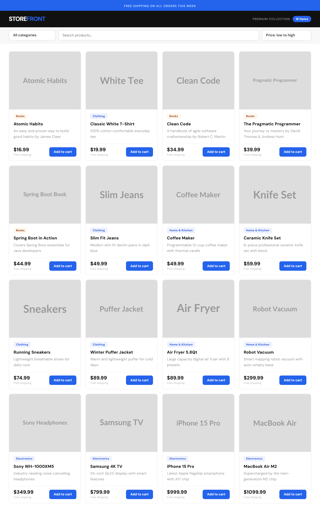

# 🛍️ StoreFront

A full-stack e-commerce product browsing app built with **Spring Boot** and **React + Vite**. Browse 40 products across 6 categories with live search, category filtering, and price sorting.



---

## ✨ Features

- 📦 **40 seeded products** across 6 categories (Electronics, Clothing, Books, Home & Kitchen, Sports, Beauty)
- 🔍 **Live search** — filter products by name in real time
- 🏷️ **Category filter** — browse by category via dropdown
- 💰 **Price sorting** — sort low to high or high to low
- 🖼️ **Product cards** — image, category badge, description, price, and Add to Cart button
- ⚡ **Fast frontend** — built with React + Vite for near-instant HMR

---

## 🗂️ Project Structure

```
StoreFront/
├── src/main/java/com/ecommerce/StoreFront/
│   ├── config/
│   │   └── DataSeeder.java          # Seeds DB with categories & products on startup
│   ├── controller/
│   │   ├── CategoryController.java  # GET /api/categories
│   │   └── ProductController.java   # GET /api/products, /api/products/category/{id}
│   ├── model/
│   │   ├── Category.java
│   │   └── Product.java
│   ├── repository/
│   │   ├── CategoryRepository.java
│   │   └── ProductRepository.java
│   ├── service/
│   └── StoreFrontApplication.java
│
├── storefront-frontend/
│   └── src/
│       ├── App.jsx              # Root component, state management, layout
│       ├── ProductList.jsx      # Product card grid
│       ├── CategoryFilter.jsx   # Category dropdown
│       ├── App.css
│       └── index.css
```

---

## 🚀 Getting Started

### Prerequisites

- Java 17+
- Maven
- Node.js 18+ & npm
- MySQL 8+

### 1. Configure the Database

Create a MySQL database and update `src/main/resources/application.properties`:

```properties
spring.datasource.url=jdbc:mysql://localhost:3306/storefront
spring.datasource.username=your_username
spring.datasource.password=your_password
spring.jpa.hibernate.ddl-auto=update
```

### 2. Run the Backend

```bash
# From the project root
./mvnw spring-boot:run
```

The API will start at `http://localhost:8080`. The database is auto-seeded with 6 categories and 40 products on first run.

### 2. Run the Frontend

```bash
cd storefront-frontend
npm install
npm run dev
```

The app will be available at `http://localhost:5173`.

---

## 🔌 API Endpoints

| Method | Endpoint                          | Description                  |
|--------|-----------------------------------|------------------------------|
| GET    | `/api/products`                   | Get all products              |
| GET    | `/api/products/category/{id}`     | Get products by category ID   |
| GET    | `/api/categories`                 | Get all categories            |

---

## 🛠️ Tech Stack

**Backend**
- Java 17 + Spring Boot 3.5.14
- Spring Data JPA + Hibernate
- MySQL (`mysql-connector-j`)
- Lombok

**Frontend**
- React 18
- Vite
- CSS with Google Fonts — [DM Sans](https://fonts.google.com/specimen/DM+Sans) (400/600/700/800) + DM Mono
- Dark mode support via `prefers-color-scheme`
- Responsive layout with CSS custom properties

---

## 📄 License

MIT
